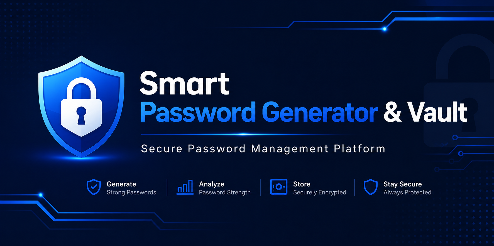
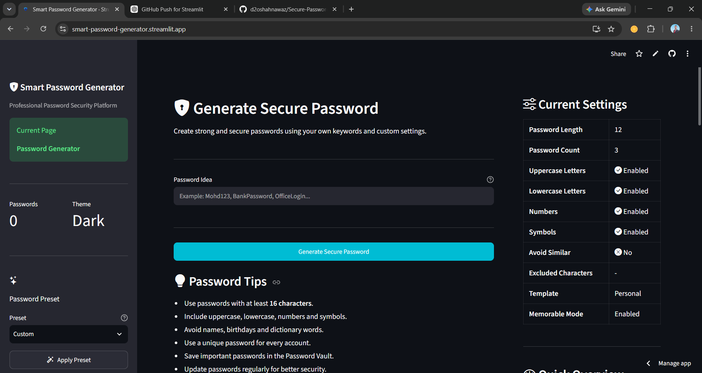
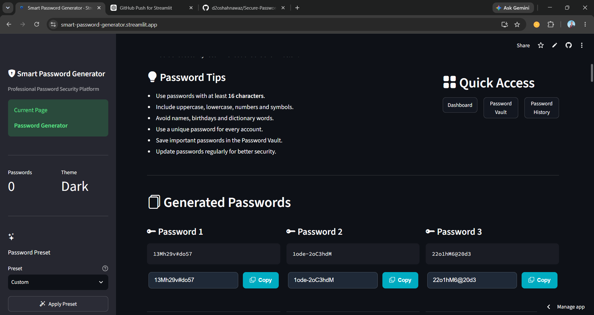
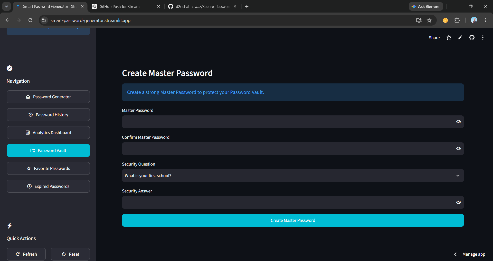
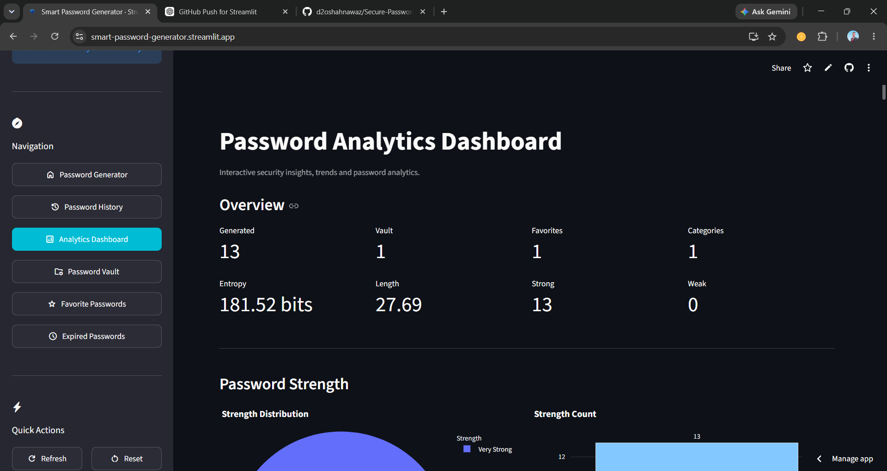
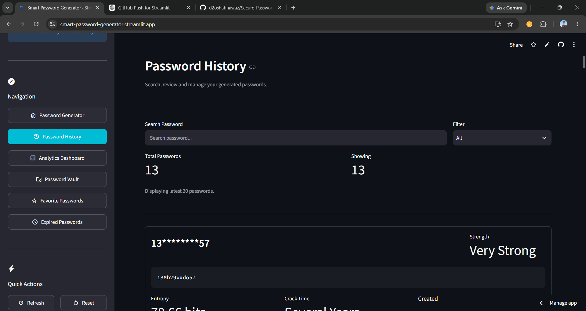

<p align="center">
  
</p>

<p align="center">
  
</p>

<h1 align="center">
Secure Password Generator & Vault
</h1>

<p align="center">
A Modern Password Security Platform built with Python, Streamlit and Cryptography.
</p>

<p align="center">


</p>

---

## Live Demo

https://smart-password-generator.streamlit.app

---

# Overview

Secure Password Generator & Vault is a professional password security application designed to help users generate strong passwords, analyze password security, securely store credentials, and manage encrypted password vaults through a clean and interactive Streamlit interface.

---

# Features

| Password Generator | Password Vault | Security |
|--------------------|---------------|----------|
| Strong Password Generation | Master Password | Fernet Encryption |
| Custom Length | Recovery Key | PBKDF2 Hashing |
| Symbols | Secure Notes | Password History |
| Templates | Favorites | Breach Detection |
| Multiple Passwords | Categories | Password Expiry |
| Exclude Characters | Search | Auto Lock |

---

# Application Preview

<p align="center">




</p>

<p align="center">




</p>

<p align="center">



</p>

---

# Technology Stack

| Technology | Description |
|------------|-------------|
| Python | Programming Language |
| Streamlit | Frontend Framework |
| SQLite | Local Database |
| Cryptography | Encryption |
| Plotly | Interactive Charts |
| Pandas | Data Processing |
| zxcvbn | Password Strength Analysis |
| OpenPyXL | Excel Export |

---

# Project Structure

```text
Secure-Password-Generator-Vault
│
├── .streamlit/
├── assets/
├── data/
│
├── app.py
├── analytics.py
├── crypto.py
├── database.py
├── generator.py
├── health.py
├── history.py
├── master.py
├── vault.py
├── ui.py
│
├── requirements.txt
├── README.md
└── LICENSE
```

---

# Installation

```bash
git clone https://github.com/d2oshahnawaz/Secure-Password-Generator-Vault.git

cd Secure-Password-Generator-Vault

pip install -r requirements.txt

streamlit run app.py
```

---

# Security

- Master Password Authentication
- Recovery Key Support
- Password Hashing using PBKDF2
- Fernet Encryption
- Secure Vault
- Password History
- Password Expiry
- Breach Detection
- Password Analytics
- Auto Lock

---

# Current Modules

| Module | Status |
|---------|:------:|
| Password Generator | ✔ |
| Password Vault | ✔ |
| Master Password | ✔ |
| Recovery Key | ✔ |
| Password Analytics | ✔ |
| Password History | ✔ |
| Password Health | ✔ |
| Categories | ✔ |
| Search | ✔ |
| Favorites | ✔ |
| CSV Export | ✔ |
| JSON Export | ✔ |

---

# Future Roadmap

- Two-Factor Authentication
- Browser Extension
- Password Sharing
- Cloud Synchronization
- Multi User Support
- Mobile Application
- REST API
- PDF Reports

---

# Contributing

Contributions are welcome.

```bash
git checkout -b feature-name

git commit -m "Add feature"

git push origin feature-name
```

Create a Pull Request after pushing your branch.

---

# Author

**Mohd Shahnawaz**

Founder & CEO  
Tech Education World ™
Founding President - ENAC Cybersecurity Club

GitHub

https://github.com/d2oshahnawaz

LinkedIn

https://www.linkedin.com/in/mohd-shahnawaz-645371205/

---

# License

This project is licensed under the MIT License.

See the LICENSE file for more information.

---

<p align="center">

Version 6.0 Professional

Built using Python • Streamlit • Cryptography

</p>
